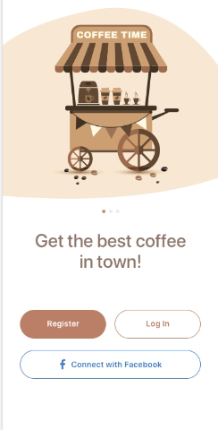
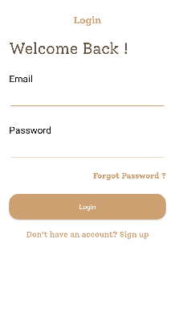
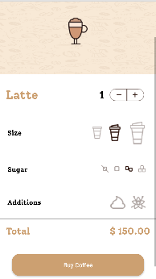
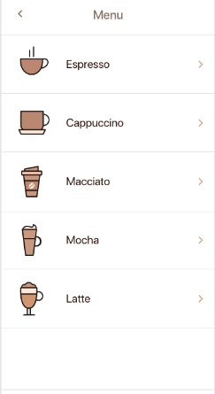

# CodeCoffee
Coffee App UI Made with Kotlin, Will use modern android development tools in near future along with spring boot backend.

**Screenshots of the App Developed**

<table>
  <tr>
    <td>Intro Screen</td>
     <td>Splash Screen</td>
   </tr>
  <tr>
    <td></td>
    <td></td>
  </tr>
   
 </table>

<table>
 <tr>
    <td>Login Screen</td>
     <td>Preferences Screen</td>
   </tr>
  <tr>
    <td></td>
    <td></td>
  </tr>
<tr>
    <td>Menu Screen</td>
   </tr>
  <tr>
    <td></td>
  </tr>
 </table>